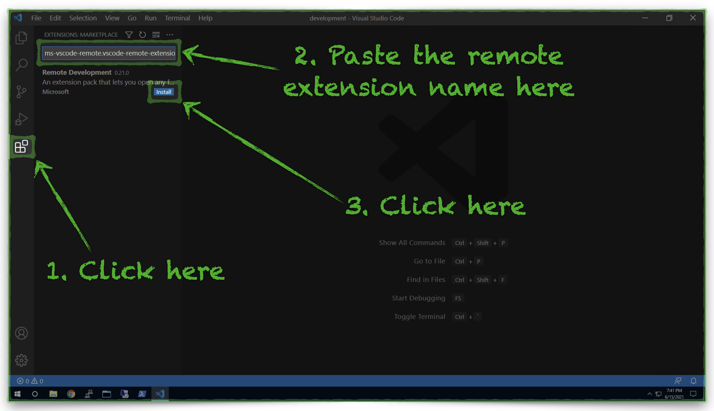
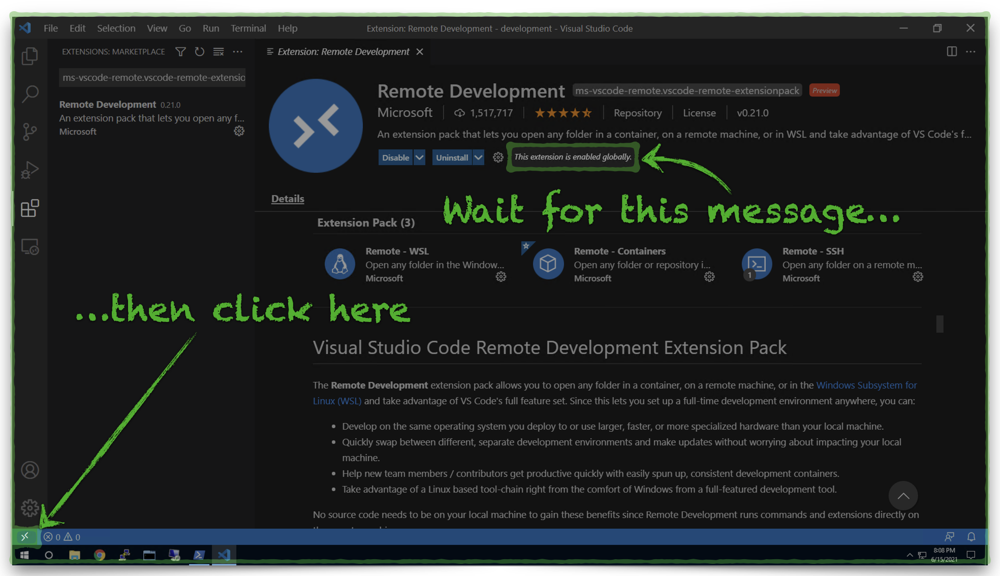
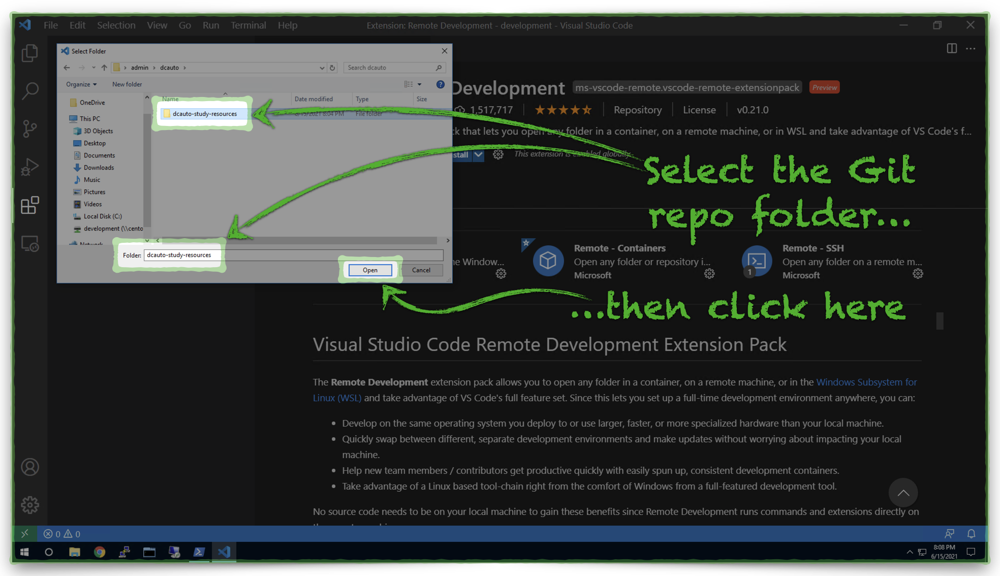
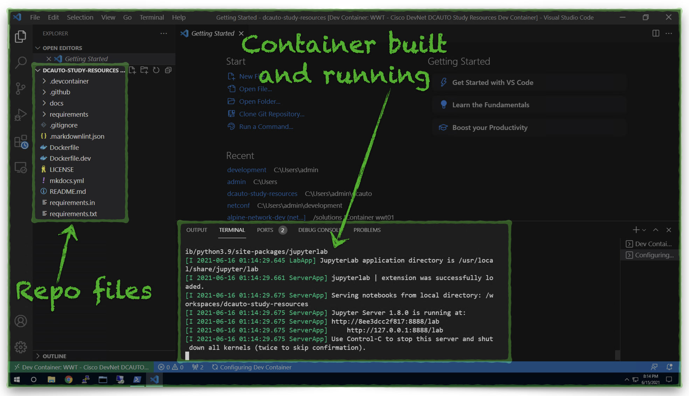

# Development Environment Setup

## Overview

:bulb: Our development environment uses the [Development Container](https://code.visualstudio.com/docs/remote/containers "Visual Studio Code Development Containers"){target=_blank} feature in Visual Studio Code.  The reasons we use this particular environment are:

- :white_check_mark: **Portability:** this development environment will work in the same way on any computer that has Visual Studio Code and Docker installed.
- :white_check_mark: **Accessibility:** the development environment is part of the Git repository which supports this guide so simply cloning the repository means you have all of the files you need.
- :white_check_mark: **Ease of Use:** Getting started with your studies quickly and the ability to easily pick up your studies where you left off means less time spent fussing with a development environment and more time available to focus on exam topic study.

---

## Dev Environment Setup

The setup process is 4 high-level steps:

!!! tip
    Click to expand each step.

??? abstract "1. Install Desktop Software"
    1. :fontawesome-brands-windows: :fontawesome-brands-apple: Choose a Windows or macOS computer
    2. :fontawesome-brands-docker: [Install Docker Desktop](https://www.docker.com/products/docker-desktop "Install Docker Desktop"){target=_blank}
    3. :fontawesome-brands-git-alt: [Install Git SCM](https://git-scm.com/downloads "Install Git SCM"){target=_blank}
    4. :material-microsoft-visual-studio-code: [Install Visual Studio Code](https://code.visualstudio.com/ "Install Visual Studio Code"){target=_blank}
    5. :material-security-network: Install [Cisco AnyConnect](https://developer.cisco.com/site/sandbox/anyconnect/ "Cisco AnyConnect VPN Client"){target=_blank} or [OpenConnect](http://www.infradead.org/openconnect/ "OpenConnect VPN Client"){target=_blank} VPN
    6. :fontawesome-solid-server: *Optional - Install a Desktop Hypervisor ([recommendations](http://localhost:8000/index.html#getting-started "Hypervisor Recommendations"){target=_blank})

??? abstract "2. Clone the DCAUTO Study Resources Git Repository"
    1. :fontawesome-solid-terminal: Open the Visual Studio Code Integrated Terminal
    2. :fontawesome-solid-folder: Navigate to the directory where you will clone the Git repository.
    3. :material-bash: Enter the following command:

        ```bash
        # Clone the repository
        git clone https://github.com/wwt/dcauto-study-resources.git
        ```

??? abstract "3. Setup Visual Studio Code"
    1. :fontawesome-brands-docker: Start Docker Desktop
    2. :material-microsoft-visual-studio-code: Launch Visual Studio Code
    3. :fontawesome-solid-table: Install the Visual Studio Code Remote Development Extension

        ??? example "3a. Copy the Remote Development Bundle extension name to your clipboard:"

            ```
            ms-vscode-remote.vscode-remote-extensionpack
            ```

        ??? example "3b. Install the Visual Studio Code Remote Development Bundle:"

            [](../../images/vs-code-install-remote-extension.png){target=_blank}

        ??? example "3c. Verify the Remote Development Bundle installation:"

            [](../../images/vs-code-verify-remote-extension.png){target=_blank}

        ??? example "3d. Reopen the current workspace in a Visual Studio Code Development Container:"

            [](../../images/vs-code-rereopen-in-confainer.png){target=_blank}

            [](../../images/vs-code-choose-repo-folder.png){target=_blank}

??? abstract "4. Observe Development Container Activation"
    1. :material-open-in-new: Wait for Development Container Activation

        ??? example "1a. Click "show log" to monitor container activation:"

            [](../../images/vs-code-devcontainer-build-start.png){target=_blank}

        ??? example "1b. Observe the development container build process:"

            !!! attention
                The initial development container build may take 5-10 minutes, please be patient.  Subsequent launches should only take a few seconds.

            [](../../images/vs-code-devcontainer-building.png){target=_blank}

    2. :fontawesome-solid-laptop-code: Verify Development Container Activation

        ??? example "2a. Observe the repository files reappear and the log message scrolling stop:"

            [](../../images/vs-code-devcontainer-build-done.png){target=_blank}

---

## Dev Environment Contents

:question: So, what all is in this development environment?

### Describe Jupyter & MkDocs servers

---

## Let's Do This

:medal: You can do this and you're already to get started! Click [this link](sections/section_0.md "Hands-On Environment Setup") to setup your development environment.
