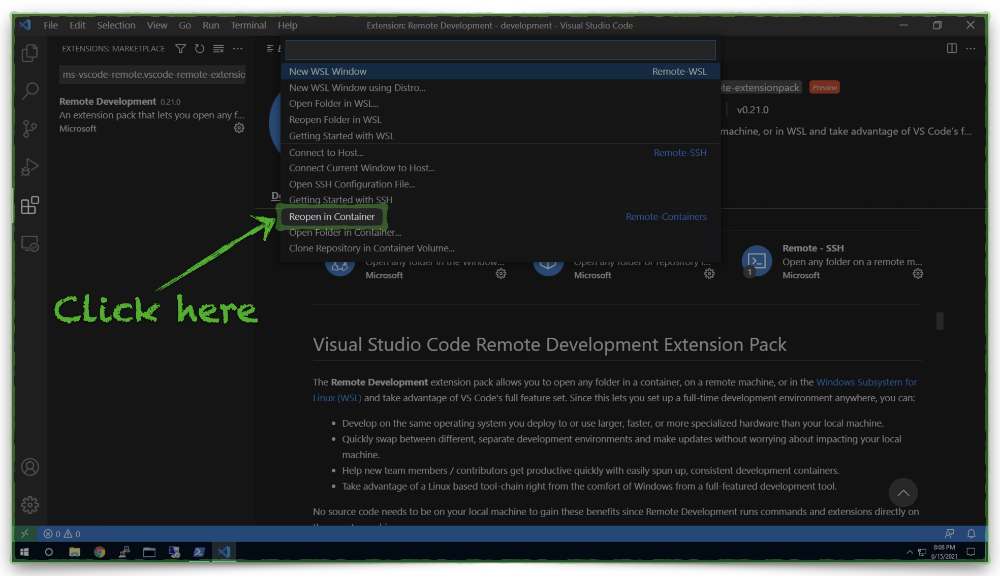

# Development Environment Setup

## Overview

:computer: In case you're wondering, "_Why do I need a development environment?  I'm studying for an exam, right?_"  In our opinion, this is an exam for operations _developers_ and a developer needs the right tools in order to do their job well.  Because the exam topics cover so many subjects, the array of tools, software packages, etc. is big enough that putting together an effective development environment, even if only for exam study, takes a lot of time.  We want you to save that time and help you get into the study materials as quickly as possible.

??? info "Development Environment Contents Overview"
    ??? abstract "Local web servers"
        - :material-web-box: MkDocs at [http://localhost:8000](http://localhost:8000 "Local MkDocs Documentation Site"){target=_blank} - for offline documentation access.
        - :fontawesome-brands-python: Jupyter Lab at [http://localhost:8888](http://localhost:8888 "Local Jupyter Lab Python Exercises"){target=_blank} - for Python code walkthroughs.

    ??? abstract "Container OS packages"
        - :fontawesome-brands-git-alt: [Git](https://git-scm.com/download/linux "Git for Debian Linux"){target=_blank} - to work with local or remote repositories.

    ??? abstract "Core Python packages"
        - [ipython](https://pypi.org/project/ipython/ "ipython on PyPi"){target=_blank} - enhanced interactive Python shell.
        - [ncclient](https://pypi.org/project/ncclient/ "ncclient on PyPi"){target=_blank} - NETCONF client for Python.
        - [pyyaml](https://pypi.org/project/PyYAML/ "PyYAML on PyPi"){target=_blank} - YAML data encoding and decoding for Python.
        - [requests](https://pypi.org/project/requests/ "requests on PyPi"){target=_blank} - Simple HTTP API interactions in Python.
        - [xmltodict](https://pypi.org/project/xmltodict/ "xmltodict on PyPi"){target=_blank} - XML Data encoding and decoding for Python.

    ??? abstract "Python linting tools"
        - [ansible-lint](https://pypi.org/project/ansible-lint/ "ansible-lint on PyPi"){target=_blank} - Lint YAML files for Ansible.
        - [autopep8](https://pypi.org/project/autopep8/ "autopep8 on PyPi"){target=_blank} - Automatic Python PEP 8 style formating.
        - [flake8](https://pypi.org/project/flake8/ "flake8 on PyPi"){target=_blank} - Lint Python files for PEP8 compliance.
        - [yamllint](https://pypi.org/project/yamllint/ "yamllint on PyPi"){target=_blank} - Lint YAML files.

    ??? abstract "Product-specific SDKs and tools"
        - :material-ansible: [Ansible](https://pypi.org/project/ansible/ "Ansible on PyPi"){target=_blank} - Automation tool for exam topic products.
        - :fontawesome-brands-python: [Cisco ACI Python SDK (Cobra)](https://developer.cisco.com/docs/aci/#!cobra-sdk-downloads/download-cobra-sdk-files "Cisco ACI Cobra SDK file downloads" ){target=_blank} - simplified Python interaction for Cisco ACI.
        - :fontawesome-brands-python: [Cisco gNMI Python package](https://pypi.org/project/cisco-gnmi/ "cisco-gnmi on PyPi"){target=_blank} - gNMI client for Python.
        - :fontawesome-brands-python: [Cisco UCS Manager Python SDK](https://pypi.org/project/ucsmsdk/ "ucsmsdk on PyPi"){target=_blank} - simplified Python interaction for Cisco UCS Manager.

    ??? abstract "Product-specific Ansible Collections"
        - [Cisco ACI Ansible Collection](https://galaxy.ansible.com/cisco/aci "Cisco ACI Ansible Collection"){target=_blank}
        - [Cisco Intersight Ansible Collection](https://galaxy.ansible.com/cisco/intersight "Cisco Intersight Ansible Collection"){target=_blank}
        - [Cisco NX-OS (Nexus) Ansible Collection](https://galaxy.ansible.com/cisco/nxos "Cisco NX-OS (Nexus) Ansible Collection"){target=_blank}
        - [Cisco UCS Ansible Collection](https://galaxy.ansible.com/cisco/ucs "Cisco UCS Ansible Collection"){target=_blank}

    ??? abstract "Microsoft PowerShell development environment"
        - :material-powershell: [PowerShell for Linux](https://docs.microsoft.com/en-us/powershell/scripting/install/installing-powershell-core-on-linux?view=powershell-7.1#debian-10 "PowerShell for Linux"){target=_blank}
        - :fontawesome-solid-server: [Cisco UCS PowerTool on PowerShell Gallery](https://www.powershellgallery.com/profiles/Cisco/ "Cisco UCS PowerTool on PowerShell Gallery"){target=_blank}
            - :fontawesome-brands-docker: [Source/credit for PowerShell launch script](https://hub.docker.com/r/ciscodevnet/ucs-powertool-core-ms "Source/credit for PowerShell Launch Script on Docker Hub"){target=_blank}

---

## VS Code Dev Containers

:bulb: Our development environment uses the [Development Container](https://code.visualstudio.com/docs/remote/containers "Visual Studio Code Development Containers"){target=_blank} feature in Visual Studio Code.  The reasons we use this particular environment are:

- :white_check_mark: **Consistency:** this development environment will work in the same way on any computer that has Visual Studio Code and Docker installed.
- :white_check_mark: **Portability:** the development environment is part of the Git repository which supports this guide so simply cloning the repository means you have all of the files you need.
- :white_check_mark: **Ease of Use:** Getting started with your studies quickly and the ability to easily pick up your studies where you left off means less time spent fussing with a development environment and more time available to focus on exam topic study.

---

## Dev Environment Setup

The setup process is 4 high-level steps:

!!! tip
    Click to expand each step.

??? abstract "1. Install Desktop Software"
    1. :fontawesome-brands-windows: :fontawesome-brands-apple: Choose a Windows or macOS computer
    2. :fontawesome-brands-docker: [Install Docker Desktop](https://www.docker.com/products/docker-desktop "Install Docker Desktop"){target=_blank}
    3. :fontawesome-brands-git-alt: [Install Git SCM](https://git-scm.com/downloads "Install Git SCM"){target=_blank}
    4. :material-microsoft-visual-studio-code: [Install Visual Studio Code](https://code.visualstudio.com/ "Install Visual Studio Code"){target=_blank}
    5. :material-security-network: Install [Cisco AnyConnect](https://developer.cisco.com/site/sandbox/anyconnect/ "Cisco AnyConnect VPN Client"){target=_blank} or [OpenConnect](http://www.infradead.org/openconnect/ "OpenConnect VPN Client"){target=_blank} VPN
    6. :fontawesome-solid-server: *Optional - Install a Desktop Hypervisor ([recommendations](/index.html#getting-started "Hypervisor Recommendations"){target=_blank})

??? abstract "2. Clone the DCAUTO Study Resources Git Repository"
    1. :fontawesome-solid-terminal: Open the Visual Studio Code Integrated Terminal
    2. :fontawesome-solid-folder: Navigate to the directory where you will clone the Git repository.
    3. :material-bash: Enter the following command:

        ```bash
        # Clone the repository
        git clone https://github.com/wwt/dcauto-study-resources.git
        ```

??? abstract "3. Setup Visual Studio Code"
    1. :fontawesome-brands-docker: Start Docker Desktop
    2. :material-microsoft-visual-studio-code: Launch Visual Studio Code
    3. :fontawesome-solid-table: Install the Visual Studio Code Remote Development Extension

        ??? example "3a. Copy the Remote Development Bundle extension name to your clipboard:"

            ```
            ms-vscode-remote.vscode-remote-extensionpack
            ```

        ??? example "3b. Install the Visual Studio Code Remote Development Bundle:"

            [](../../images/vs-code-install-remote-extension.png){target=_blank}

        ??? example "3c. Verify the Remote Development Bundle installation:"

            [](../../images/vs-code-verify-remote-extension.png){target=_blank}

        ??? example "3d. Reopen the current workspace in a Visual Studio Code Development Container:"

            [](../../images/vs-code-reopen-in-confainer.png){target=_blank}

            [](../../images/vs-code-choose-repo-folder.png){target=_blank}

??? abstract "4. Observe Development Container Activation"
    1. :material-open-in-new: Wait for Development Container Activation

        ??? example "1a. Click "show log" to monitor container activation:"

            [](../../images/vs-code-devcontainer-build-start.png){target=_blank}

        ??? example "1b. Observe the development container build process:"

            !!! attention
                The initial development container build may take 5-10 minutes, please be patient.  Subsequent launches should only take a few seconds.

            [](../../images/vs-code-devcontainer-building.png){target=_blank}

    2. :fontawesome-solid-laptop-code: Verify Development Container Activation

        ??? example "2a. Observe the repository files reappear and the log message scrolling stop:"

            [](../../images/vs-code-devcontainer-build-done.png){target=_blank}

---

## Now You're Ready

:thumbsup: Your development environment is ready to go and that means it's time to get to the exam topics. Click [this link](sections/section_1.md "Section 1.0 Exam Topics") to check out the Section 1 of the exam topics.
