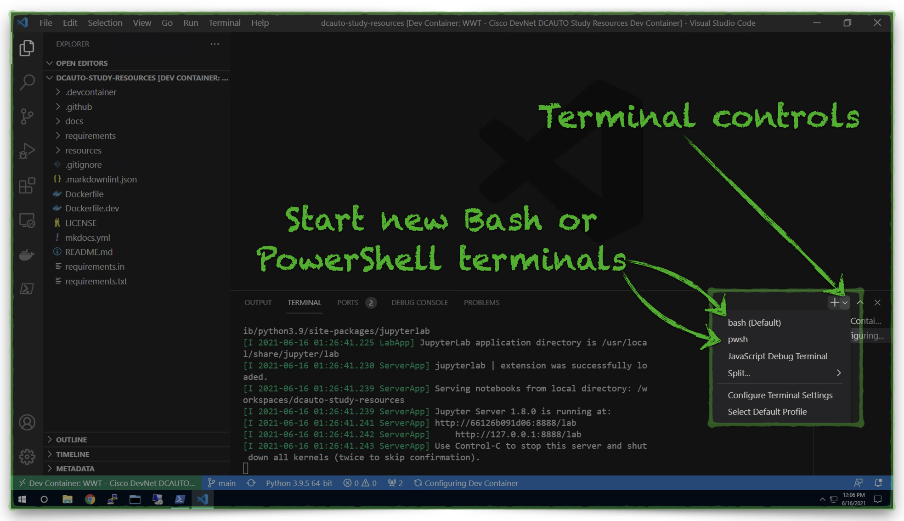

# Controller Based Data Center Networking

## Overview

This section of the exam topics has a focus on working with Cisco Application Centric Infrastructure (ACI) programmatically.  It is essential to be familiar with ACI's building blocks, specifically the ACI Policy Object Model, in order to effectively construct and parse its API payloads.

???+ note "Section 2.0 Topic Details"
    - 2.1 Describe the following:
        - 2.1.a ACI target policy
        - 2.1.b ACI application hosting capabilities
        - 2.1.c Implementation of an ACI application from the Cisco ACI Apps Center
    - 2.2 Leverage the API inspector to explore the REST API calls made by the ACI GUI
    - 2.3 Construct a Python script to create an application policy using the ACI REST API
    - 2.4 Construct a Python script to create an application policy using the ACI Cobra SDK
    - 2.5 Construct an Ansible playbook to create an application policy
    - 2.6 Describe the benefits of integrating Kubernetes infrastructure using the ACI CNI plugin

---

## Resources

### :material-code-json: Cisco DevNet

??? abstract "Learning Labs"
    - [ACI Programmability](https://developer.cisco.com/learning/tracks/aci-programmability "ACI Programmability Learning Path"){target=_blank}
        - **Introduction to ACI Programmability Module** - All Labs
        - **Intermediate ACI Programmability Module** - All Labs
        - **Introduction to ACI and Ansible Module** -  All Labs

---

### Videos on Demand

#### :fontawesome-solid-dollar-sign: Pluralsight

??? abstract "Individual Courses"
    - [Cisco Data Center Core: Implementing Automation](https://www.pluralsight.com/courses/cisco-data-center-core-implementing-automation "Cisco Data Center Core: Implementing Automation"){target=_blank}

---

#### :fontawesome-solid-laptop-code: Cisco YouTube

??? abstract "Cisco Live"
    - [Mastering ACI Programmability and Automating common DC Tasks](https://www.youtube.com/watch?v=8K6MHPZmc5A "Mastering ACI Programmability and Automating common DC Tasks"){target=_blank}

??? abstract "NetDevOps Live"
    - [Exploring the ACI networking plugin for Kubernetes](https://www.youtube.com/watch?v=9d0mzB5jUP0 "Exploring the ACI networking plugin for Kubernetes"){target=_blank}

---

### :fontawesome-regular-keyboard: Hands-On Learning

??? abstract "DevNet Sandbox Labs"
    - [DevNet Always-On ACI Sandbox](https://sandboxapicdc.cisco.com "DevNet Always-On ACI Sandbox"){target=_blank}
        - [Sandbox Access Instructions](https://devnetsandbox.cisco.com/RM/Diagram/Index/5a229a7c-95d5-4cfd-a651-5ee9bc1b30e2?diagramType=Topology "Sandbox Access Instructions"){target=_blank}

??? abstract "Development Environment Resources"

    !!! attention
        - The links below require that the local Jupyter Lab server is active and listening on [**http://localhost:8888**](http://localhost:8888 "Jupyter Lab Server"){target=_blank}
            - The Visual Studio Code Development Environment automatically activates the Jupyter Lab server.

        !!! tip
            - You may also use Visual Studio Code to explore the same code samples and hands-on exercises.  The **resources** folder within the Development Environment Container contains all of the source files.
        

    - :material-ansible: [Ansible Files](http://localhost:8888/lab/tree/resources/aci/ansible "Ansible Root Folder"){target=_blank}
        - [Sample Configuration File](http://localhost:8888/lab/workspaces/auto-c/tree/resources/aci/ansible/ansible.cfg "Sample Configuarion File"){target=_blank}
        - [Sample Playbook 1](http://localhost:8888/lab/workspaces/auto-c/tree/resources/aci/ansible/create_aci_tenant_and_children.yml "Sample Playbook 1"){target=_blank}
        - [Sample Playbook 2](http://localhost:8888/lab/workspaces/auto-c/tree/resources/aci/ansible/delete_aci_tenant_and_children.yml "Sample Playbooks 2"){target=_blank}
        - [Sample Playbook 3](http://localhost:8888/lab/workspaces/auto-c/tree/resources/aci/ansible/get_tenant.yml "Sample Playbooks 3"){target=_blank}
        - [Sample Inventory File (.ini format)](http://localhost:8888/lab/workspaces/auto-c/tree/resources/aci/ansible/inventory/hosts.ini "Sample Inventory File (.ini format)"){target=_blank}
        - [Sample Inventory File (.yml format)](http://localhost:8888/lab/workspaces/auto-c/tree/resources/aci/ansible/inventory/hosts.yml "Sample Inventory File (.yml format)"){target=_blank}
        - [Sample Host Variables File](http://localhost:8888/lab/workspaces/auto-c/tree/resources/aci/ansible/inventory/host_vars/sandboxapicdc.cisco.com.yml "Sample Host Variables File"){target=_blank}
    - :fontawesome-brands-python: [ACI Python (Cobra) SDK](http://localhost:8888/lab/workspaces/auto-I/tree/resources/aci/cobra-sdk "ACI Python (Cobra) SDK"){target=_blank}
        - [Practice Exercise](http://localhost:8888/lab/workspaces/auto-I/tree/resources/aci/cobra-sdk/exercises/apic_cobra_sdk_exercises.ipynb "Practice Exercise"){target=_blank}
        - [Practice Exercise Solution](http://localhost:8888/lab/workspaces/auto-I/tree/resources/aci/cobra-sdk/exercises/solutions/apic_cobra_sdk_exercise_solution.ipynb "Practice Exercise Solution"){target=_blank}
        - [Practice Exercise Example](http://localhost:8888/lab/workspaces/auto-I/tree/resources/aci/cobra-sdk/exercises/examples/apic_cobra_sdk_exercises_example_1.ipynb "Practice Exercise Example"){target=_blank}
    - :material-api: [ACI REST API](http://localhost:8888/lab/tree/resources/aci/rest-api "ACI REST API"){target=_blank}
        - [Practice Exercise](http://localhost:8888/lab/workspaces/auto-I/tree/resources/aci/rest-api/exercises/apic_rest_exercises.ipynb "Practice Exercise"){target=_blank}
        - [Practice Exercise Solution](http://localhost:8888/lab/workspaces/auto-I/tree/resources/aci/rest-api/exercises/solutions/apic_rest_exercise_solution.ipynb "Practice Exercise Solution"){target=_blank}
        - [Practice Exercise Example #1](http://localhost:8888/lab/workspaces/auto-I/tree/resources/aci/rest-api/exercises/examples/apic_rest_exercises_example_1.ipynb "Practice Exercise Example #1"){target=_blank}
        - [Practice Exercise Example #2](http://localhost:8888/lab/workspaces/auto-I/tree/resources/aci/rest-api/exercises/examples/apic_rest_exercises_example_2.ipynb "Practice Exercise Example #2"){target=_blank}
        - [Python Code Samples](http://localhost:8888/lab/workspaces/auto-I/tree/resources/aci/rest-api/code-samples "Python Code Samples"){target=_blank}

    ??? tip "New to Jupyter Lab? Expand This Section for Help"

        ??? example "1. Open the [Jupyter Lab Server](http://localhost:8888 "Jupyter Lab Server"){target=_blank}"

            {target=_blank}

        ??? example "2. Navigate to the **resources/aci** Directory"

            {target=_blank}

        ??? example "3. Open a Jupyter Notebook in Either the **cobra-sdk/exercises** or **rest-api/exercises** Folder"

            {target=_blank}

??? abstract "Management Information Tree (MIT) Assembly Challenge"
    - Review the scrambled, disconnected ACI MIT diagrams in the **resources/aci/mit** folder, within the development environment, and try to draw them (digitally or on paper) in the correct positions with the correct connections.
        - Option #1 - [.png quiz #1](http://localhost:8888/lab/tree/resources/aci/mit/png/quiz_1.png ".png quiz #1"){target=_blank}, [.png quiz #2](http://localhost:8888/lab/tree/resources/aci/mit/png/quiz_1.png ".png quiz #2"){target=_blank}, and [.png solution](http://localhost:8888/lab/tree/resources/aci/mit/png/solution/solution.png ".png solution"){target=_blank}
        - Option #2 -  [Visio Quiz and Solution File](http://localhost:8888/lab/tree/resources/aci/mit/visio/quizzes_and_solution.vsdx "Visio Quiz and Solution File"){target=_blank}

---

## :material-file-document-outline: Documentation

??? abstract "ACI Fundamentals"
    - [ACI Terminology Reference](https://www.cisco.com/c/en/us/td/docs/switches/datacenter/aci/apic/sw/kb/b_ACI_Terminology.html "ACI Terminology Reference"){target=_blank}
    - [ACI Policy Model Guide](https://www.cisco.com/c/en/us/td/docs/switches/datacenter/aci/apic/sw/policy-model-guide/b-Cisco-ACI-Policy-Model-Guide.html "ACI Policy Model Guide"){target=_blank}
        - [ACI Policy Model Quick Reference](https://www.cisco.com/c/dam/en/us/td/i/500001-600000/500001-510000/501001-502000/501289.jpg "ACI Policy Model Quick Reference"){target=_blank}
    - [Cisco DC App Center](https://dcappcenter.cisco.com "Cisco DC App Center"){target=_blank}

??? abstract "ACI Programmability"
    - [APIC REST API Configuration Guide](https://www.cisco.com/c/en/us/td/docs/switches/datacenter/aci/apic/sw/2-x/rest_cfg/2_1_x/b_Cisco_APIC_REST_API_Configuration_Guide.html "APIC REST API Configuration Guide"){target=_blank}
    - [APIC Python SDK Documentation](https://cobra.readthedocs.io/en/latest/ "Cisco APIC Python SDK Documentation"){target=_blank}
    - [Ansible Galaxy ACI Collection](https://galaxy.ansible.com/cisco/aci "Ansible Galaxy ACI Collection"){target=_blank}

??? abstract "ACI Kubernetes CNI Plugin Integration for Red Hat OpenShift"
    - [ACI and Kubernetes Solution Overview](https://www.cisco.com/c/en/us/solutions/collateral/data-center-virtualization/application-centric-infrastructure/solution-overview-c22-739493.html "ACI and Kubernetes Solution Overview"){target=_blank}
    - [ACI and Kubernetes Architecture and Design Guide](https://www.cisco.com/c/en/us/td/docs/switches/datacenter/aci/apic/white_papers/Cisco-ACI-CNI-Plugin-for-OpenShift-Architecture-and-Design-Guide.html "ACI and Kubernetes Architecture and Design Guide"){target=_blank}
    - [ACI and Kubernetes Integration Guide](https://www.cisco.com/c/en/us/td/docs/switches/datacenter/aci/apic/sw/kb/b_Kubernetes_Integration_with_ACI.html "ACI and Kubernetes Integration Guide"){target=_blank}

---

## :fontawesome-solid-lightbulb: Insights

- We spent plenty of time watching the videos and reading the documentation in this guide although we spent most of our time going through the hands-on learning exercises over, and over, and over again.  The practice made a big difference in our ability to retain so many details.  Forcing ourselves to type our way through the Jupyter Lab exercises was really hard and was also our best teacher.

- The Cisco DevNet learning labs for ACI were a great starting point for us and set the tone for the things we needed to learn and practice.  Following those up with the Jupyter and MIT exercises was very beneficial.

- The star resource to practice just about any skills related to ACI is the **[DevNet Always-On ACI Sandbox](https://sandboxapicdc.cisco.com "DevNet Always-On ACI Sandbox"){target=_blank}**.  This is a publicly-accessible (no-VPN required), reservationless, read/write, read/write ACI simulator and we used it excessively.  All of the code samples, Jupyter Notebooks, and Ansible Playbooks bundled in this repository use this sandbox.

!!! caution
        - From time to time, the **[DevNet Always-On ACI Sandbox](https://sandboxapicdc.cisco.com "DevNet Always-On ACI Sandbox"){target=_blank}** can be a bit slow or fail to respond to your API call, browser session, etc.  Generally, after a minute or two, we found the sandbox would recover from these situations.

    !!! tip "tips"
        - Spend plenty of time working with ACI both programmatically _and_ in the APIC GUI.
        - The [ACI visore tool](https://www.cisco.com/c/en/us/support/docs/cloud-systems-management/application-policy-infrastructure-controller-apic/118839-technote-visore-00.html "ACI visore tool"){target=_blank} provides a great way to understand relationships between ACI objects in the MIT.
        - The [ACI API Inspector](https://aci-prog-lab.ciscolive.com/lab/pod1/references/find-object "ACI API Inspector"){target=_blank} vastly simplifies the process to construct REST payloads for ACI.  We recommend that you spend plenty of time observing how you can use APIC GUI interactions, via the API Inspector, to construct REST payloads within Python.

## On to Section 3.0

:thumbsup:  Great job getting through ACI!  Let's keep going, click [this link](section_3.md "Section 3.0") to check out **Section 3.0** exam topics and resources.
